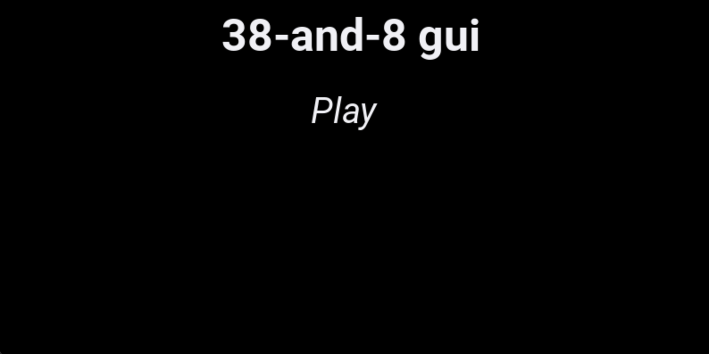
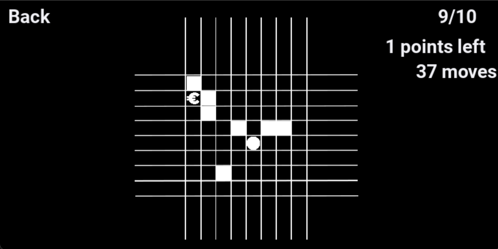
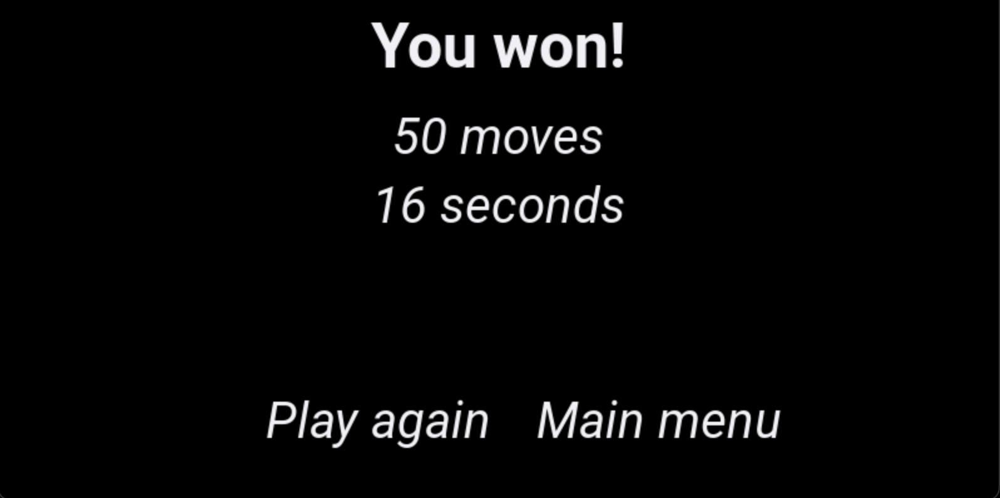

# 38-and-8 gui 1.6.1
Гра 38-and-8 на Python pygame

# Що нового в версії 1.6.1
    - Додано додаткові звуки та видалення повторення рекордів у файлі records.json
    - Змінено іконку програми

# Якщо не запускається гра
    - Перевірте, що скрипт запускається у папці src
    - Перевірте, що Python встановлений
    - Встановіть бібліотеку pygame (pip3 install pygame (на Windows pip install pygame))
    - Оновіть Python

# Демонстрація ПЗ

