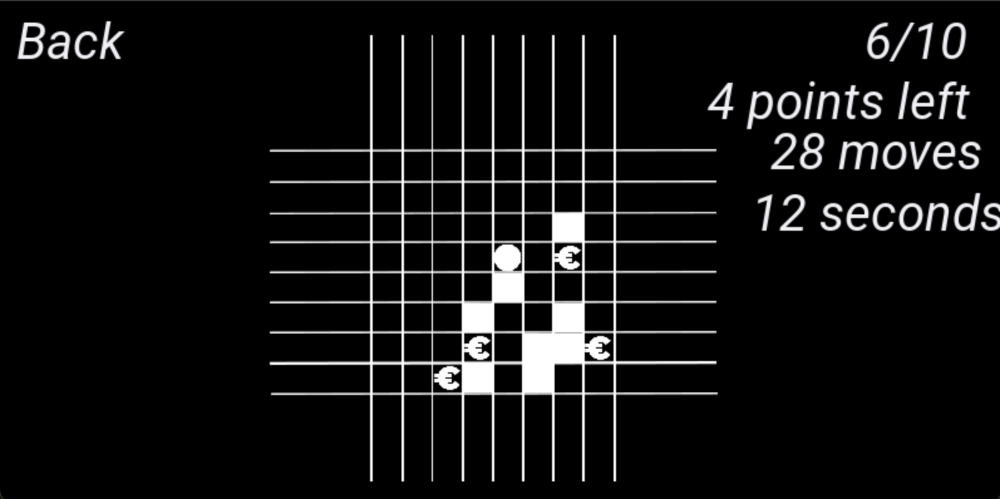

# 38-and-8 gui 1.1.0
Гра 38-and-8 на Python pygame

# Що нового в версії 1.1.0
    - Можна розбивати пригради, але тільки три рази за гру
    - Гра показує кількість очок, які вам потрібно зібрати та скільки ви вже зібрали

# Демонстрація ПЗ

